# Performance Test Agent - System Architecture

This document outlines the architecture of the Performance Test Agent, illustrating the interaction between the Frontend, Flask Backend, Agent Pipeline, and external integrations.

```mermaid
graph TD
    %% Styles
    classDef frontend fill:#e3f2fd,stroke:#1565c0,stroke-width:2px;
    classDef backend fill:#fff3e0,stroke:#ef6c00,stroke-width:2px;
    classDef agent fill:#e8f5e9,stroke:#2e7d32,stroke-width:2px;
    classDef module fill:#f3e5f5,stroke:#7b1fa2,stroke-width:2px;
    classDef external fill:#eceff1,stroke:#455a64,stroke-width:2px;
    classDef mcp fill:#fff8e1,stroke:#fbc02d,stroke-width:2px;

    subgraph Client_Layer ["Frontend Layer"]
        UI["index.html"]:::frontend
        JS["Bootstrap / Vanilla JS"]:::frontend
        ChartJS["Chart.js (Visualization)"]:::frontend
        UI --> JS
        JS --> ChartJS
    end

    subgraph Server_Layer ["Backend Layer"]
        Server["server.py (Flask)"]:::backend
        API["REST API (/run, /api/*)"]:::backend
        SSE["SSE Stream (/stream)"]:::backend
        ChatBot["GenAI Chat Client"]:::backend

        Server --> API
        Server --> SSE
        Server --> ChatBot
    end

    subgraph Agent_Layer ["Agent Orchestration Layer (agent.py)"]
        Master["MasterAgent"]:::agent
        Context["PipelineContext"]:::agent

        subgraph Agents ["Sequential Agent Pipeline"]
            direction TB
            A1["MCPAgent"]:::agent
            A2["IngestionAgent"]:::agent
            A3["GeneratorAgent"]:::agent
            A4["ValidationAgent"]:::agent
            A5["NeuroSanAgent (Pre-flight)"]:::agent
            A6["ExecutionAgent"]:::agent
            A7["MonitoringAgent"]:::agent
            A8["AnalysisAgent"]:::agent
            A9["NeuroSanAgent (Analysis)"]:::agent
            A10["NotificationAgent"]:::agent
            A11["CleanupAgent"]:::agent
        end

        Master -- Orchestrates --> Agents
        Agents -- Read/Write --> Context
    end

    subgraph Module_Layer ["Helper Modules"]
        Parser["parser.py"]:::module
        Gen["generator.py"]:::module
        SLA["sla.py"]:::module
        Report["report_generator.py"]:::module
    end

    subgraph MCP_Layer ["Model Context Protocol"]
        MCP_Fetch["Fetch Server"]:::mcp
        MCP_FS["Filesystem Server"]:::mcp
        MCP_PG["PostgreSQL Server"]:::mcp
        MCP_GH["GitHub Server"]:::mcp
    end

    subgraph External_Layer ["External Tools & Services"]
        k6["k6 Binary"]:::external
        Node["Node.js / npx"]:::external
        NS_Studio["Neuro-San Studio (Repo)"]:::external
        Jira["Jira API"]:::external
        GitHub["GitHub API"]:::external
        Gemini["Google Gemini API"]:::external
        Webhook["Webhook URL"]:::external
        FS["File System (Results)"]:::external
    end

    %% Frontend to Backend
    JS -- HTTP POST --> API
    JS -- EventSource --> SSE

    %% Backend to Agent
    Server -- subprocess.Popen --> Master
    Server -- Reads --> FS

    %% Agent to Modules
    A2 --> Parser
    A3 --> Gen
    A8 --> SLA
    A8 --> Report

    %% Agent to MCP
    A1 -- Spawns (stdio) --> MCP_Fetch
    A1 -- Spawns (stdio) --> MCP_FS
    A1 -- Spawns (stdio) --> MCP_PG
    A1 -- Spawns (stdio) --> MCP_GH

    A2 -- Uses --> MCP_Fetch
    A10 -- Uses --> MCP_GH

    %% MCP to External
    MCP_Fetch -- HTTP --> Jira
    MCP_GH -- HTTP --> GitHub
    MCP_FS -- Reads/Writes --> FS

    %% Agent to External Tools
    A4 -- Spawns --> Node
    A4 -- Spawns --> k6
    A6 -- Spawns --> k6
    A7 -- Reads Stdout --> k6
    A5 -- Spawns --> NS_Studio
    A9 -- Spawns --> NS_Studio
    A8 -- API Call --> Gemini
    A10 -- HTTP POST --> Webhook
    ChatBot -- API Call --> Gemini

    %% Data Flow
    k6 -- Writes --> FS
    Report -- Writes PDF --> FS
```

